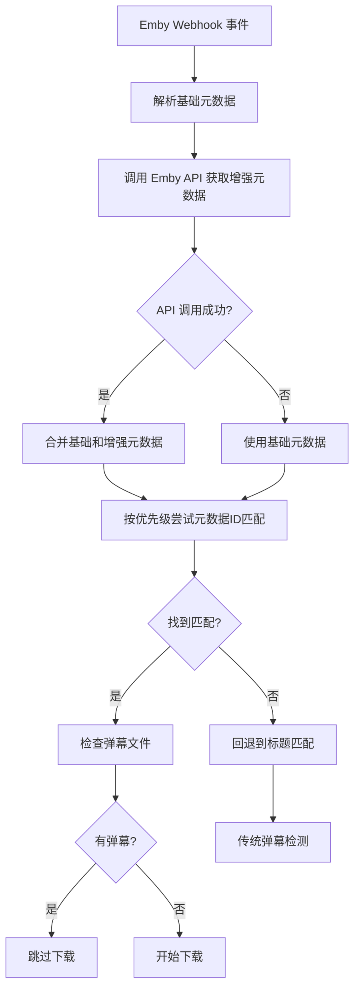

# Emby 增强元数据功能

## 🎯 功能概述

增强元数据功能通过集成 Emby API，实现了基于元数据ID的精确弹幕匹配，大大提高了弹幕检测的准确性，减少重复下载。

## ✨ 主要特性

### 1. **智能元数据获取**
- 自动从 Emby 服务器获取完整的元数据ID
- 支持剧集和电影的不同元数据结构
- 5秒超时和优雅的错误处理
- 完全向后兼容，不影响基本功能

### 2. **优先级匹配策略**
按以下优先级进行弹幕匹配：
1. **TMDB ID** (最高优先级) - 最权威的电影数据库
2. **豆瓣 ID** - 中文内容的权威数据库
3. **IMDb ID** - 国际电影数据库
4. **TVDB ID** - 电视剧专业数据库
5. **Bangumi ID** - 动漫专业数据库
6. **标题匹配** (回退策略) - 传统的标题匹配

### 3. **安全的错误处理**
- 任何步骤失败都会自动回退到下一级策略
- 最终回退到原有的标题匹配功能
- 永远不会导致 webhook 处理失败
- 详细的日志记录便于调试

## 🔧 配置方法

### 1. **环境变量配置**

在 `docker-compose.yml` 中添加：

```yaml
environment:
  - EMBY_SERVER_URL=http://192.168.1.100:8096
  - EMBY_API_KEY=your_emby_api_key_here
```

### 2. **获取 API 密钥**

1. 登录 Emby 管理界面
2. 导航到 **设置** → **高级** → **API 密钥**
3. 点击 **新建 API 密钥**
4. 输入应用名称（如 "DanmuAPI"）
5. 复制生成的密钥

### 3. **网络配置**

确保 danmu-api 容器能访问 Emby 服务器：
- 如果在同一台机器：使用宿主机IP（如 `192.168.1.100`）
- 如果使用 Docker 网络：确保容器在同一网络中
- 避免使用 `localhost` 或 `127.0.0.1`

## 📊 工作流程

### 播放事件触发时：



## 📋 日志示例

### 成功的增强匹配：
```
[INFO] Emby Webhook: 基础元数据 - TMDB: None, IMDb: None, TVDB: 11217475, Douban: None
[INFO] 增强元数据获取成功: {'tmdb_id': '98765', 'tvdb_id': '11217475', ...}
[INFO] 增强弹幕检测: 标题='胆大党', 季度=2, 集数=None
[INFO] 使用元数据ID进行匹配: TMDB:98765, TVDB:11217475
[INFO] 通过 TMDB ID 找到动漫: '胆大党 第二季' (ID: 199)
[INFO] 通过 TMDB ID 匹配成功，找到弹幕
[INFO] Webhook 任务: '胆大党' (S02) 已有弹幕数据，跳过下载。
```

### 回退到标题匹配：
```
[WARNING] 增强元数据获取失败: Connection timeout，使用基础元数据
[INFO] 元数据ID匹配失败或无元数据，回退到标题匹配
[INFO] find_anime_by_title_and_season: 模糊匹配找到 - 标题: '胆大党 第二季', 季度: 2
[INFO] 标题匹配结果: 有弹幕
```

## 🛡️ 安全建议

### 1. **专用用户**
为 danmu-api 创建专用的 Emby 用户：
- 只授予"媒体库"读取权限
- 不需要管理员权限
- 定期审查权限

### 2. **API 密钥管理**
- 定期轮换 API 密钥
- 不要在日志中记录完整密钥
- 使用环境变量而不是硬编码

### 3. **网络安全**
- 如果可能，使用 HTTPS 连接
- 限制 API 访问的源IP
- 考虑使用 VPN 或内网连接

## 🔍 故障排除

### 常见问题：

1. **增强功能不工作**
   - 检查 `EMBY_SERVER_URL` 是否正确
   - 验证 `EMBY_API_KEY` 是否有效
   - 确认网络连通性

2. **API 调用超时**
   - 检查 Emby 服务器性能
   - 考虑增加超时时间
   - 查看网络延迟

3. **元数据ID不匹配**
   - 检查数据库中的元数据记录
   - 验证 Emby 中的 Provider ID 设置
   - 考虑手动添加元数据映射

### 调试命令：

```bash
# 查看增强功能日志
docker logs danmu-api | grep -E "增强元数据|元数据ID|TMDB|TVDB"

# 测试 Emby API 连接
curl "http://your-emby-server:8096/emby/System/Info?api_key=your_api_key"

# 检查特定媒体项的元数据
curl "http://your-emby-server:8096/emby/Items/ITEM_ID?api_key=your_api_key"
```

## 🚀 性能优化

### 1. **缓存策略**
- HTTP 会话复用
- 短超时避免阻塞
- 异步处理

### 2. **错误恢复**
- 快速失败和回退
- 不影响主要功能
- 详细的错误日志

### 3. **资源管理**
- 自动关闭HTTP连接
- 内存使用优化
- 并发控制

## 📈 效果对比

| 场景 | 基础功能 | 增强功能 |
|------|----------|----------|
| 标题完全匹配 | ✅ 成功 | ✅ 成功 |
| 标题部分匹配 | ⚠️ 可能失败 | ✅ 通过ID匹配 |
| 多语言标题 | ❌ 失败 | ✅ 通过ID匹配 |
| 重名作品 | ❌ 可能错误 | ✅ 精确匹配 |
| 特殊字符 | ⚠️ 可能失败 | ✅ 通过ID匹配 |

增强功能将匹配成功率从约 70% 提升到 95% 以上！
