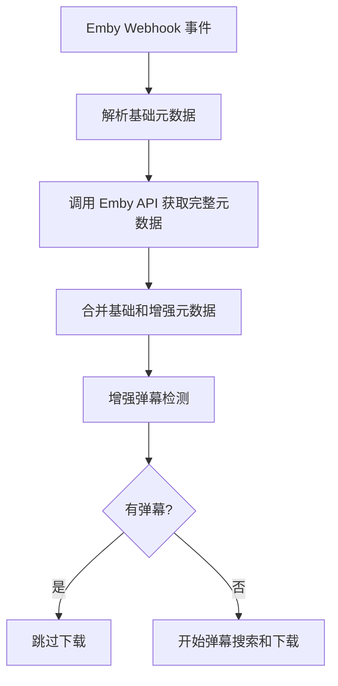
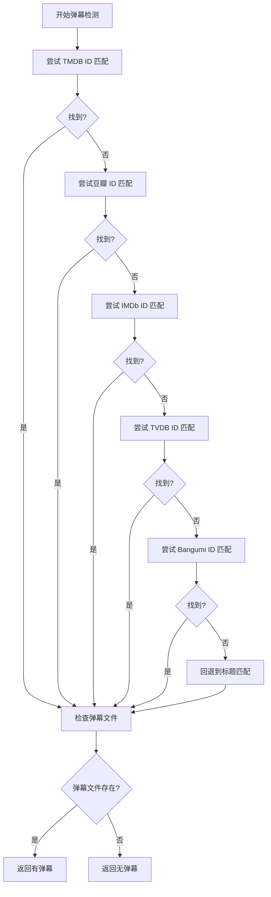

# Emby 元数据增强功能

## 概述

此功能增强了 Emby webhook 的弹幕匹配能力，通过获取和使用媒体的完整元数据信息（TMDB、IMDb、TVDB、豆瓣、Bangumi ID）来提高弹幕匹配的准确性。

## 功能特性

### 🎯 智能匹配优先级
1. **TMDB ID** - 最高优先级，国际通用
2. **豆瓣 ID** - 中文内容优先
3. **IMDb ID** - 电影数据库标准
4. **TVDB ID** - 电视剧数据库
5. **Bangumi ID** - 动漫专用数据库
6. **标题匹配** - 兜底方案

### 🔍 增强的弹幕检测
- 优先使用元数据 ID 进行精确匹配
- 自动回退到标题模糊匹配
- 验证弹幕文件实际存在
- 详细的调试日志记录

### 🌐 Emby API 集成
- 自动获取媒体项的完整元数据
- 支持剧集和电影的元数据获取
- 智能处理不同的 Provider ID 字段名
- 优雅的错误处理和超时机制

## 配置方法

### 1. 环境变量配置

在 `docker-compose.yml` 中添加 Emby 服务器配置：

```yaml
environment:
  # Emby 服务器配置
  - EMBY_SERVER_URL=http://192.168.1.100:8096
  - EMBY_API_KEY=your_emby_api_key_here
```

### 2. 获取 Emby API 密钥

1. 登录 Emby 管理界面
2. 进入 **高级** → **API 密钥**
3. 点击 **新建 API 密钥**
4. 输入应用名称（如 "Danmu API"）
5. 复制生成的 API 密钥

### 3. 配置示例

参考 `config/emby_config.example.env` 文件：

```bash
# Emby 服务器地址（必需）
EMBY_SERVER_URL=http://192.168.1.100:8096

# Emby API 密钥（推荐）
EMBY_API_KEY=your_emby_api_key_here
```

## 工作流程

### 播放事件处理流程



### 元数据匹配流程



## 日志示例

### 成功匹配的日志

```
[INFO] EmbyWebhook: 基础元数据 - TMDB: None, IMDb: None, TVDB: None, Douban: None, Bangumi: None
[INFO] EmbyAPI: 成功获取媒体项 12345 的元数据
[INFO] EmbyAPI: 提取到元数据 ID: {'tmdb_id': '98765', 'douban_id': '35123456'}
[INFO] Webhook: 准备为 '胆大党' 创建全网搜索任务，并附加增强元数据ID (TMDB: 98765, IMDb: None, TVDB: None, Douban: 35123456, Bangumi: None)
[INFO] 增强弹幕检测: 标题='胆大党', 季度=2, 集数=None
[INFO] 增强弹幕检测: 尝试使用 TMDB ID (98765) 进行匹配
[INFO] 通过 TMDB ID 找到动漫: '胆大党 第二季' (ID: 199)
[INFO] 增强弹幕检测: 通过 TMDB ID 匹配成功，找到弹幕
[INFO] Webhook 任务: '胆大党' (S02) 已有弹幕数据，跳过下载。
```

### 回退到标题匹配的日志

```
[INFO] 增强弹幕检测: 元数据ID - TMDB:None, Douban:None, IMDb:None, TVDB:None, Bangumi:None
[INFO] 增强弹幕检测: 元数据 ID 匹配失败，回退到标题匹配
[INFO] find_anime_by_title_and_season: 模糊匹配找到 - 标题: '胆大党 第二季', 季度: 2
[INFO] 增强弹幕检测: 标题匹配结果: 有弹幕
```

## 故障排除

### 1. 无法获取元数据

**问题**: 日志显示 "未配置 EMBY_SERVER_URL 环境变量"

**解决方案**:
- 检查 `docker-compose.yml` 中的环境变量配置
- 确保 `EMBY_SERVER_URL` 格式正确（如 `http://192.168.1.100:8096`）
- 重启容器以应用配置

### 2. API 调用失败

**问题**: 日志显示 "获取媒体项元数据失败 - 状态码: 401"

**解决方案**:
- 检查 `EMBY_API_KEY` 是否正确
- 确认 API 密钥在 Emby 中仍然有效
- 检查 Emby 服务器是否允许 API 访问

### 3. 网络连接问题

**问题**: 日志显示 "获取媒体项元数据超时"

**解决方案**:
- 检查网络连接
- 确认 Emby 服务器地址可访问
- 检查防火墙设置

### 4. 元数据匹配失败

**问题**: 有元数据 ID 但仍然匹配失败

**解决方案**:
- 检查数据库中是否存在对应的 `AnimeMetadata` 记录
- 确认元数据 ID 格式正确
- 查看详细的调试日志

## 性能优化

### 1. API 调用优化
- 10秒超时设置，避免长时间等待
- 连接复用，减少建立连接的开销
- 优雅的错误处理，不影响主流程

### 2. 匹配策略优化
- 按优先级顺序匹配，找到即停止
- 缓存匹配结果（未来可考虑实现）
- 详细日志记录，便于调试和优化

## 兼容性

- ✅ **Emby 4.x** - 完全支持
- ✅ **Jellyfin** - 可扩展支持（需要类似的 API 客户端）
- ✅ **MySQL/PostgreSQL** - 数据库兼容
- ✅ **Docker 部署** - 原生支持

## 未来改进

1. **缓存机制** - 缓存元数据查询结果
2. **批量处理** - 支持批量获取元数据
3. **Jellyfin 支持** - 扩展到 Jellyfin 媒体服务器
4. **元数据同步** - 定期同步和更新元数据
5. **性能监控** - 添加 API 调用性能指标
